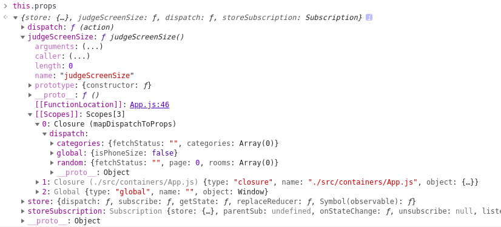

> 项目中遇到的比较有代表的坑

## React-redux中connect()注意事项

如果一个Container组件没有相应属性传入（表现为mapStateToProps的使用），connect()的第一项参数也不能省略。

**错:**
```
//App组件没有响应式属性需要传入，只有方法传入
export default connect(
  mapDispatchToProps
)(App)
/*
  按照这种错误的做法，后果是：mapDispatchToProps函数里的dispatch会被指定为state
  如下图所示：
*/
```

**正确**
```
/*
  const mapStateToProps = state => ({})
  const mapDispatchToProps = dispatch => ({
    onClick: () => dispatch(dosomething())
  })
*/
export default connect(
  mapStateToProps,
  mapDispatchToProps
)(App)
```